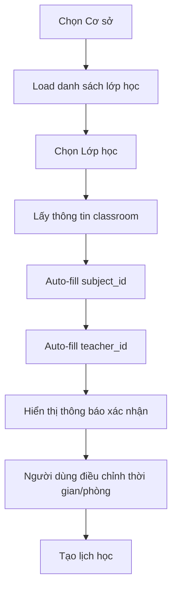

# Tính năng Tự động điền Môn học trong Tạo Lịch

## 🎯 Mô tả
Tính năng tự động điền môn học khi chọn lớp học trong form tạo lịch học, giúp người dùng tiết kiệm thời gian và giảm lỗi nhập liệu.

## ✨ Tính năng chính

### 1. **Tự động điền môn học**
- Khi chọn lớp học trong form tạo lịch, môn học sẽ được tự động điền từ `classroom.subject_id`
- Giáo viên cũng được tự động điền từ `classroom.teacher_id`

### 2. **Hiển thị thông tin đầy đủ**
- Dropdown lớp học hiển thị: `Tên lớp - Tên giáo viên - Tên môn học`
- Giúp người dùng dễ dàng nhận biết và chọn lớp phù hợp

### 3. **Thông báo xác nhận**
- Hiển thị thông báo màu xanh khi môn học được tự động điền
- Icon ✓ và text "Môn học đã được tự động điền từ lớp học đã chọn"

## 🔧 Thay đổi kỹ thuật

### Frontend (`frontend/src/app/schedule/page.tsx`)

#### 1. **Cập nhật `handleClassroomChange`**
```typescript
const handleClassroomChange = (classroomId: string) => {
  const classroom = classrooms.find(c => c.id === classroomId);
  if (classroom) {
    setFormData(prev => ({
      ...prev,
      classroom_id: classroomId,
      teacher_id: classroom.teacher_id || '',
      subject_id: classroom.subject_id || '', // Auto-fill subject
    }));
  }
};
```

#### 2. **Cập nhật hiển thị dropdown lớp học**
```typescript
{classrooms.map((classroom) => {
  const teacherName = teachers.find(t => t.id === classroom.teacher_id)?.name || 'Chưa gán';
  const subjectName = subjects.find(s => s.id === classroom.subject_id)?.name || 'Chưa gán';
  return (
    <option key={classroom.id} value={classroom.id}>
      {classroom.name} - {teacherName} - {subjectName}
    </option>
  );
})}
```

#### 3. **Thêm thông báo xác nhận**
```typescript
{formData.classroom_id && formData.subject_id && (
  <p className="text-xs text-green-600 flex items-center gap-1">
    <CheckCircle className="w-3 h-3" />
    Môn học đã được tự động điền từ lớp học đã chọn
  </p>
)}
```

## 📋 Cách sử dụng

### 1. **Tạo lịch học mới**
1. Vào trang **Lịch học** (Schedule)
2. Nhấn nút **"Tạo lịch học"**
3. Chọn **Cơ sở** từ dropdown
4. Chọn **Lớp học** từ dropdown (hiển thị: Tên lớp - Giáo viên - Môn học)
5. **Môn học** và **Giáo viên** sẽ được tự động điền
6. Thông báo xanh xuất hiện xác nhận việc tự động điền
7. Điều chỉnh thời gian, phòng học nếu cần
8. Nhấn **"Tạo lịch học"**

### 2. **Chỉnh sửa lịch học**
- Khi mở form chỉnh sửa, tất cả thông tin đã được điền sẵn
- Có thể thay đổi lớp học và môn học sẽ tự động cập nhật

## 🗄️ Yêu cầu dữ liệu

### 1. **Lớp học phải có môn học**
- Tất cả lớp học cần có `subject_id` được gán
- Nếu lớp học chưa có môn học, tính năng auto-fill sẽ không hoạt động

### 2. **Script gán môn học**
```bash
python assign_subjects_to_classrooms.py
```
Script này sẽ:
- Tìm tất cả lớp học chưa có môn học
- Gán môn học đầu tiên trong danh sách cho các lớp đó
- Cập nhật database

## 🧪 Kiểm tra tính năng

### 1. **Test API**
```bash
python test_simple_check.py
```
Kiểm tra xem tất cả lớp học đã có `subject_id` chưa.

### 2. **Test Frontend**
1. Khởi động frontend: `cd frontend && npm run dev`
2. Vào trang Lịch học
3. Tạo lịch học mới
4. Chọn lớp học và quan sát môn học được tự động điền

## 🎨 UI/UX Improvements

### 1. **Dropdown lớp học**
- Hiển thị đầy đủ thông tin: `Tên lớp - Giáo viên - Môn học`
- Dễ dàng phân biệt các lớp học

### 2. **Thông báo xác nhận**
- Màu xanh lá cây
- Icon checkmark
- Text rõ ràng và ngắn gọn

### 3. **Trải nghiệm người dùng**
- Giảm thiểu thao tác nhập liệu
- Tự động điền thông tin chính xác
- Phản hồi trực quan khi auto-fill

## 🔄 Luồng hoạt động



## ✅ Kết quả

- ✅ **Tự động điền môn học** khi chọn lớp học
- ✅ **Tự động điền giáo viên** khi chọn lớp học  
- ✅ **Hiển thị thông tin đầy đủ** trong dropdown
- ✅ **Thông báo xác nhận** trực quan
- ✅ **Cải thiện UX** giảm thiểu nhập liệu thủ công
- ✅ **Tương thích** với hệ thống hiện tại

## 🚀 Lợi ích

1. **Tiết kiệm thời gian**: Không cần chọn môn học thủ công
2. **Giảm lỗi**: Tự động điền đúng môn học của lớp
3. **Trải nghiệm tốt**: Thông tin rõ ràng, phản hồi trực quan
4. **Nhất quán**: Đảm bảo môn học khớp với lớp học
